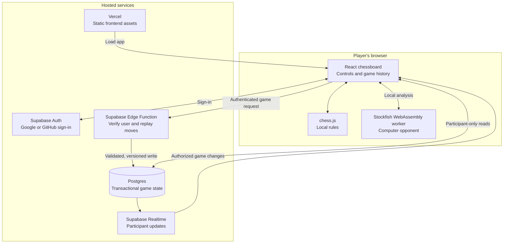

# Chess architecture

A browser chessboard for local computer games and authenticated invitation multiplayer.

The browser engine is local to each player. Hosted services are needed for online games and sign-in, but not for computer play.

[PNG image](overview.png) · [Editable Mermaid source](overview.mmd)

Arrows show requests or data movement; replies return along the same route. Boxes grouped as local or hosted show where work runs. Authentication boundaries are labeled where present.

## Component roles

| Component | Role | Learn more |
| --- | --- | --- |
| Browser interface and chess.js | Display the board, enforce local rules and preserve local game history. | [Reference](../../src/) |
| Stockfish | Runs in a browser worker; computer games use no hosted AI API. | [Reference](https://stockfishchess.org/) |
| Vercel | Serves the built frontend and engine assets. | [Reference](https://vercel.com/docs) |
| Supabase Auth | Provides full-page sign-in through Google or GitHub. | [Reference](https://supabase.com/docs/guides/auth) |
| Edge Function and Postgres | Verify identity and moves, then commit using transaction and version checks. | [Reference](../../supabase/) |
| Realtime | Delivers game changes; database policies restrict reads to participants. | [Reference](https://supabase.com/docs/guides/realtime) |

## Boundaries and limitations

Signing in alone does not grant access to every game. The function checks each bearer token and assigns seats; restricted database operations and participant policies protect game state. Free service quotas can interrupt online play. The separate chess-serverless-functions repository currently has no backend implementation; this repository contains the maintained backend.

## Source evidence

Reviewed on 2026-10-04 against remote-default commit `0c97cc80c36c0e30bb149579397dd5916f167e90`. This is a source/configuration review, not a fresh deployment or health test. Provider references explain component roles; they are not owner administration links.

- [src/hooks/useStockfishWorker.tsx](../../src/hooks/useStockfishWorker.tsx)
- [src/hooks/useOnlineGame.ts](../../src/hooks/useOnlineGame.ts)
- [supabase/functions/game/index.ts](../../supabase/functions/game/index.ts)
- [supabase/migrations](../../supabase/migrations)
- [vercel.json](../../vercel.json)

## Editable diagram

The Mermaid source and images describe the same view. To regenerate with Mermaid CLI 12, use [the saved renderer configuration](mermaid.config.json): `mmdc -i overview.mmd -o overview.svg -c mermaid.config.json -b white` and repeat with `-o overview.png -s 2`. The configuration uses a light theme, Arial at 20 px, classic shapes and portable SVG text. Images should be inspected after changes for complete labels and legible type. Machine addresses, account identifiers, credentials and deployment-specific recovery details are intentionally omitted.
